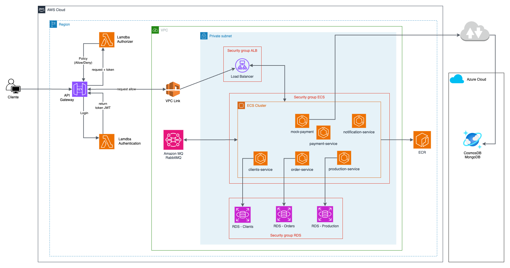

# Infra `lanchonete-app` com Terraform automatizado com GitHub Actions

Este repositório tem o código terraform com CI/CD usando GitHub Actions 
para provisionar toda a infra da aplicacação na AWS.

## Diagrama infra

## Diagrama filas

